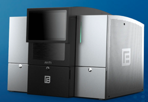

# aviti-tools
[(Nucleomics-VIB)](https://github.com/Nucleomics-VIB)
 - Aviti-Tools
==========

*All tools presented below have only been tested by me and may contain bugs, please let me know if you find some. Each tool relies on dependencies normally listed at the top of the code (cpan for perl and cran for R will help you add them)*

*[[back-to-top](#top)]*  

<h4>Please send comments and feedback to <a href="mailto:nucleomics.bioinformatics@vib.be">nucleomics.bioinformatics@vib.be</a></h4>

Licensed under the **GNU General Public License v3.0** — see [`LICENSE`](LICENSE) for the
full text, and [`NOTICE.md`](NOTICE.md) for attribution and the relicensing history.

Attribute the work to *VIB Nucleomics Core*, and licence derived work under the same terms.
Relicensed on 2026-08-27; copies obtained before that date remain available to their
holders under the previous CC BY-SA 3.0 terms.
