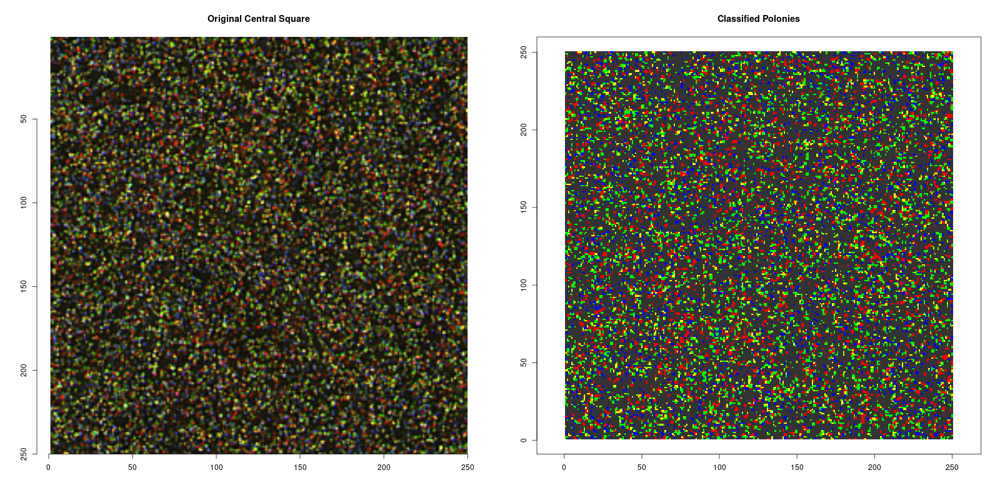
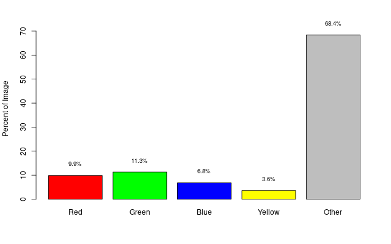

## AVITI Pixel Color Analysis Report with Adaptive Thresholding

#### V242402_4409_6_ThumbnailLane2.png

Analysis of central square region (250x250 pixels)

### QC Metrics

|Metric                        |Value  |
|:-----------------------------|:------|
|Total Colored Pixels          |19,738 |
|Colored Pixel Percentage      |31.58% |
|Color Balance Score           |0.565  |
|Color Balance                 |PASS   |
|Signal-to-Background Ratio    |0.462  |
|Signal-to-Background          |PASS   |
|Adaptive Intensity Threshold  |0.200  |
|Adaptive Difference Threshold |27.000 |
|Red Channel Threshold         |0.343  |
|Green Channel Threshold       |0.324  |
|Blue Channel Threshold        |0.203  |

### Pixel Counts by Color

- **Red**: 6,175 (9.88%)
- **Green**: 7,068 (11.31%)
- **Blue**: 4,261 (6.82%)
- **Yellow**: 2,234 (3.57%)
- **Other**: 42,762 (68.42%)

### Final QC Assessment

**Integrated QC Score:** PASS

### Plots

- 
- 
